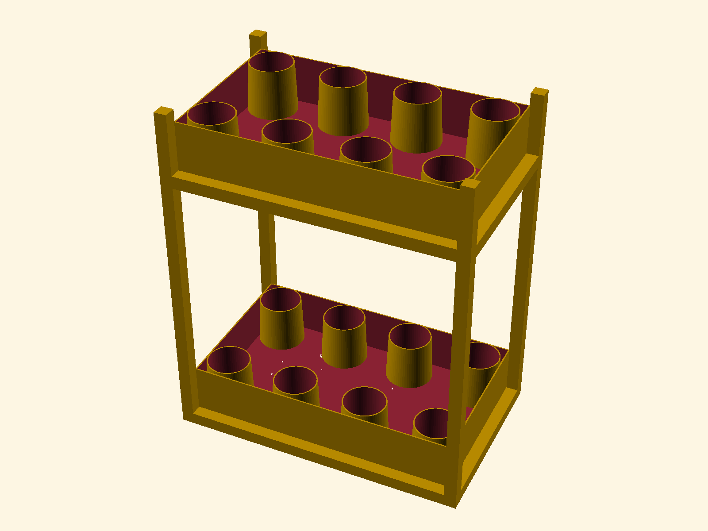
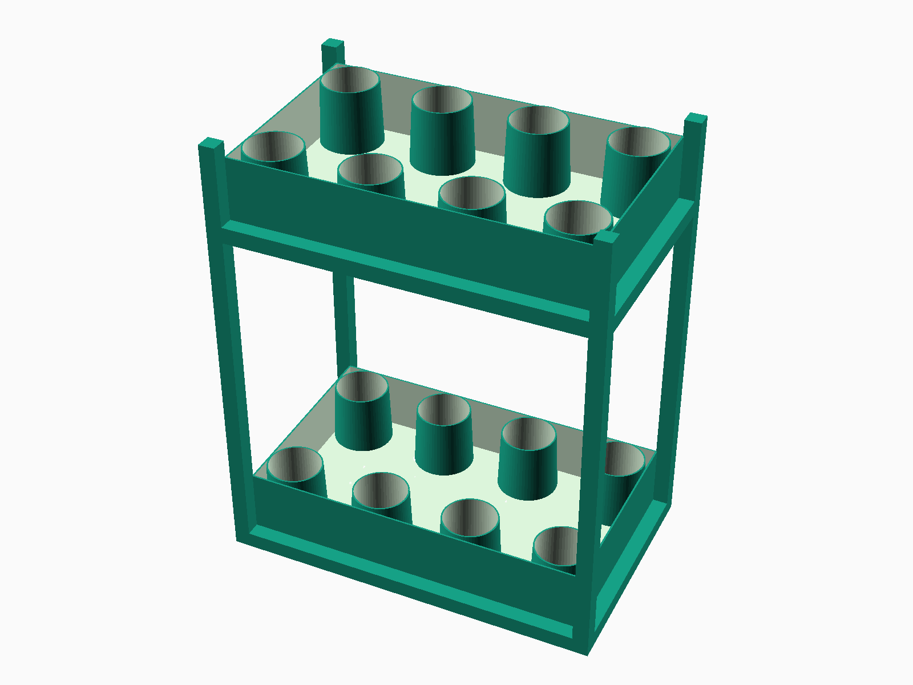

# Window-Sill LED Grow Shelf (GridBeam Edition)

A modular, repairable two-tier herb-growing shelf that fits a windowsill.  
Built using **GridBeam tri-joint construction** and illuminated with **5 V LED strips**.  
All parts are **open hardware**, designed to be remade, improved, or recycled.




## Quick Start

### 1. Clone the repository

```bash
git clone https://github.com/<yourname>/window-sill-grow-shelf.git
cd window-sill-grow-shelf
```

### 2. Make the build script executable

```bash
chmod +x make_grow_shelf_zine.sh
```

### 3. Build everything

```bash
./make_grow_shelf_zine.sh
```

The script:

* Installs dependencies (`pandoc`, LaTeX, `openscad`, `imagemagick`, etc.)
* Detects model changes and re-renders if needed
* Regenerates the Markdown (`grow_shelf_zine.md`)
* Produces a new printable **PDF zine** (`grow_shelf_zine.pdf`)
* Starts a local preview server and shows a **QR code** to open the project portal

## Workflow: Making Revisions

The project supports continuous iteration across both the **hardware model** and **documentation**.

### Option A — Update the model

1. Edit the OpenSCAD source:

   ```bash
   nano grow_shelf_model.scad
   ```
   or open in the GUI:
   ```bash
   openscad grow_shelf_model.scad
   ```
2. Adjust geometry, dimensions, or materials.
3. Save and rebuild:
   ```bash
   ./make_grow_shelf_zine.sh
   ```
   → New renders and updated zine.

### Option B — Update the zine content

1. Edit the Markdown file:

   ```bash
   nano grow_shelf_zine.md
   ```
2. Rebuild only the PDF:
   ```bash
   ./make_grow_shelf_zine.sh
   ```

## Portal Page

After each build, a lightweight `index.html` portal is generated.  
When you scan the QR code printed by the script, it opens this page with large buttons for:

| Action | Target |
|--------|---------|
| **View Zine PDF** | Opens `grow_shelf_zine.pdf` in browser |
| **Launch Zine UI** | Opens `zine-ui/index.html` if built with Vite |
| **Browse Files** | Opens local project directory |

## File Overview

| File | Description |
|------|--------------|
| `make_grow_shelf_zine.sh` | Build + preview script |
| `grow_shelf_model.scad` | Parametric OpenSCAD geometry |
| `grow_shelf_render.png` | Primary render (Solarized) |
| `grow_shelf_texture.png` | Textured render (Nature) |
| `grow_shelf_zine.md` | Markdown zine source |
| `grow_shelf_zine.pdf` | Printable PDF |
| `index.html` | Generated landing page for local preview |
| `zine-ui/` | Optional React/Vite frontend |
| `.env` | GitHub username configuration |

## Printing

* Format: **A4 double-sided**
* Flip on: **short edge**
* Fold and staple along center to form an 8-page booklet.

## Dependencies

Installed automatically, but you can install manually:

```bash
sudo apt-get install pandoc texlive-xetex texlive-latex-extra \
texlive-latex-recommended texlive-fonts-recommended openscad imagemagick nodejs npm qrencode
```

## License

This project is released into the public domain under the **CC0 1.0 Universal (Public Domain Dedication)**.

You may copy, modify, distribute, and use the work — for any purpose, including commercial — without asking permission.

For details, see:  
[https://creativecommons.org/publicdomain/zero/1.0/](https://creativecommons.org/publicdomain/zero/1.0/)


## Contributing

Pull requests welcome for:

* Model or visual improvements (`grow_shelf_model.scad`)
* Renders, layout tweaks, or new modules
* Documentation or translation updates
* Enhancing the zine portal or UI features

## Automation Example

To rebuild automatically on every commit:

```bash
./make_grow_shelf_zine.sh && git add grow_shelf_render.png grow_shelf_texture.png grow_shelf_zine.pdf && git commit -m "auto: rebuild zine" && git push
```

> “Make it modular. Make it honest. Make it easy to rebuild.”
